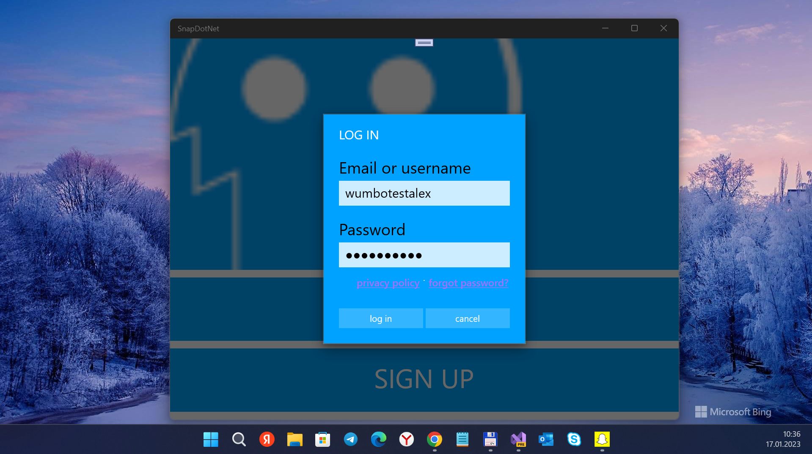
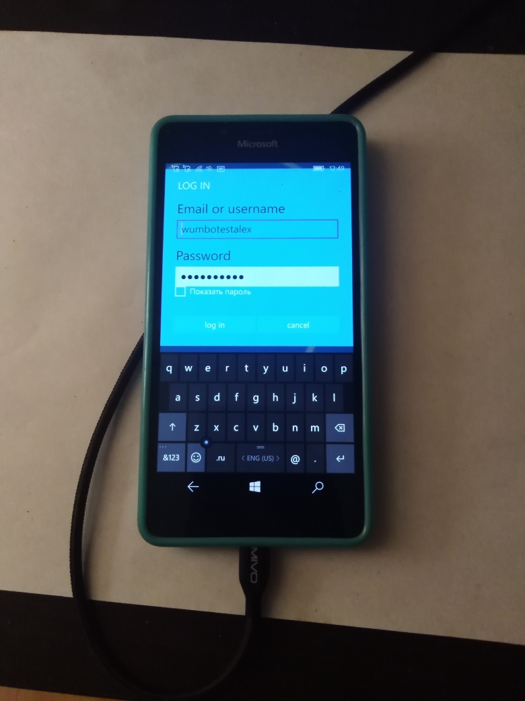

# SnapChat v1-alpha
SnapChat for Windows 10 Mobile. Draft / RnD only.
This is my "quick and dirty" fork of [Snapchat for Windows Phone 8.1](https://github.com/0xdeafcafe/SnapDotNet).

## Screenshot(s)
<table>
<tr>
<td> 
 
</td>
</tr>
<tr>
<td> 
 
</td>
</tr>
</table>

### About (original)

"A windows phone snapchat app. unfinished, probally broken by now. 
Some access keys are in the code, but they've all been revoked. 
You'll get banned if you use this. If it even works, lol."

## My 2 cents
- 8.1 to 10.0 "upgrade" (UWP)
- Req. os. build (Win. SDK): 17793
- Min. os. build (Win. SDK): 15063 (for my Lumia 950, not for more poor Winphones, heh))

## Problems
I cannot reconstruct https://snapdotnet.azure-mobile.net/ :-( 
Maybe the role of "Azure functions" is only push service... idk :-/

## References / Credits
- https://github.com/0xdeafcafe/SnapDotNet Original SnapChat app (SnapDotNet and ColdSnap codename) 
- https://github.com/0xdeafcafe Alexander Forbes-Reed, Great C# developer
- https://msaville8.wordpress.com/2014/11/13/communicating-with-the-snapchat-api-using-c/ Communicating with the Snapchat API
- https://msaville8.wordpress.com/2014/11/17/processing-snapchat-responses/ Processing Snapchat Responses
- https://msaville8.wordpress.com/2014/11/20/monitoring-secure-network-traffic-in-the-android-emulator/ Monitoring Secure Network Traffic in the Android Emulator

## ..
AS IS. No support. Research / Dev only. DIY

## .
[m][e] 2023
